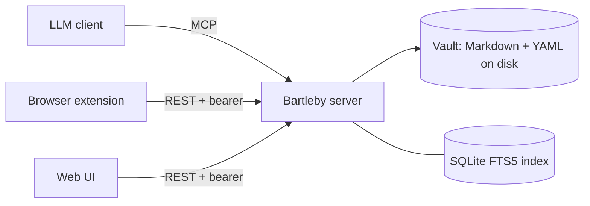

# Bartleby

A self-hosted personal knowledge vault that any LLM can read and write through
the Model Context Protocol.

[](./LICENSE)
[](https://github.com/t11z/bartleby/actions/workflows/ci.yml)

Bartleby keeps your notes as plain Markdown files on a server you control, and
exposes them over three surfaces from a single process: a spec-compliant **MCP**
endpoint for LLM clients, a versioned **REST API** for the browser extension and
web UI, and the **web UI** itself. Your assistant can save what you tell it and
recall it later; you can clip a web page from your browser; you can browse and
read everything from a small UI — all against the same vault.

## Why this exists

The convenient way to give an assistant a memory is to hand your notes to someone
else's server. Bartleby takes the other path: **you host it, you hold the data.**
There is no hosted instance, no account, no tenant but you. The server makes no
outbound calls — no telemetry, no update checks — and the browser extension talks
only to the server you point it at. That single-user, self-hosted posture is the
feature, not a limitation: your knowledge vault stays a directory of Markdown
files on your own machine that you can read, back up, and move with ordinary
tools, whether or not Bartleby is running.

## Screenshot

> _TBD: screenshot of the web UI vault browser._

## Quick start

You need Docker and a bearer token of your choosing (any long random string).

```bash
git clone https://github.com/t11z/bartleby.git
cd bartleby/infra
cp .env.example .env
# edit .env: set BARTLEBY_AUTH_TOKEN to a long random secret
docker compose up -d
```

Then open <http://localhost:8080/> for the web UI, and point your MCP client at
`http://localhost:8080/mcp` using the same token. Put it behind HTTPS before
exposing it to the internet — see [`infra/Caddyfile.example`](./infra/Caddyfile.example)
and the [installation guide](https://t11z.github.io/bartleby/installation/).

## Architecture

One backend process serves all three surfaces and reads/writes a single vault of
Markdown files.



The full design — data model, API, storage, and roadmap — is in
[`docs/IMPLEMENTATION_PLAN.md`](./docs/IMPLEMENTATION_PLAN.md).

## Client compatibility

The MCP server is spec-compliant and works with any MCP-capable client. It is
**tested primarily with Claude**. If you find an incompatibility with another
MCP client, please file an issue.

## Documentation

Full docs — installation, configuration reference, MCP tool reference, and API
reference — live at **<https://t11z.github.io/bartleby/>**.

## Contributing and security

- Contributions are welcome — see [`CONTRIBUTING.md`](./CONTRIBUTING.md).
- To report a vulnerability, see [`SECURITY.md`](./SECURITY.md).

## License

[MIT](./LICENSE) © Thomas Sprock.
