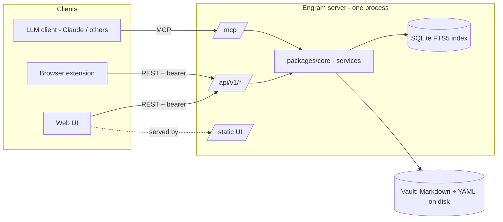

# Engram — Implementation Plan

This is the source of truth for Engram's architecture and delivery roadmap.
It records decisions so individual sessions and contributors do not re-litigate
them. Working conventions (how to branch, test, commit) live in `CLAUDE.md`, not
here. Individual decisions with trade-offs are captured as ADRs under
[`docs/adr/`](./adr/).

Status: **v1 shipped; v2 in progress.** The v1 milestones (Phases 0–5) are
delivered. v2 reshapes how Engram reads and writes the vault around portable
Markdown conventions (ADRs 0007–0011); see §8 "v2 — convention-based model".

---

## 1. Architecture summary

Engram is an LLM-agnostic, self-hosted personal knowledge vault. A single
backend process exposes three surfaces:

- `/mcp` — spec-compliant Model Context Protocol endpoint for LLM clients.
- `/api/v1/*` — versioned REST API for the browser extension and web UI.
- `/` — the static web UI bundle, served by the same process.

Decisions of record (not up for revision in v1):

- **Topology.** Public monorepo, MIT licensed, self-hosted per user. One user,
  one server, their own machine. No multi-tenancy, no accounts, no hosted
  *backend* demo. (A static, client-only demo with mock data and no server is
  fine — see [ADR-0006](./adr/0006-static-mock-demo.md).)
- **Single process.** MCP, REST, and static UI are served by one FastAPI app.
  Rationale in [ADR-0002](./adr/0002-mcp-rest-coexist.md).
- **Storage.** Markdown files on disk with YAML frontmatter; the filesystem is
  the source of truth. A rebuildable SQLite FTS5 index accelerates search.
- **Convention-based vault model** ([ADR-0007](./adr/0007-convention-based-vault-model.md)).
  Engram reads the vault as portable Markdown conventions dictate rather than
  imposing its own shape. The **vault-relative path is a note's canonical
  handle**; the ULID `id` is an optional alias (off by default — Engram never
  injects an id into a note that lacks one). Frontmatter is minimal/optional:
  `title` derives from the first heading or the filename, and timestamps fall
  back to the file mtime when absent; unknown frontmatter keys are preserved.
  Notes can live in nested folders with free-form `<slug>.md` filenames.
- **Link graph** ([ADR-0008](./adr/0008-wikilink-and-backlink-graph-model.md)).
  `[[wikilinks]]`, `![[embeds]]`, inline `#tags`, and Markdown links are parsed;
  the index stores a link/backlink graph and tags (the union of frontmatter and
  inline tags).
- **In-place editing + optimistic concurrency**
  ([ADR-0009](./adr/0009-in-place-editing-and-optimistic-concurrency.md)). Notes
  are editable; writes use a content-hash `ETag` with `If-Match` (REST requires
  it). Reads return an `ETag` header.
- **MCP resources & prompts**
  ([ADR-0010](./adr/0010-mcp-resources-and-prompts.md)) accompany the tools.
- **Vault co-presence; no built-in sync**
  ([ADR-0011](./adr/0011-vault-co-presence-no-built-in-sync.md)). Engram does
  not synchronise the vault across hosts. It assumes the vault directory is
  co-present on its host (same machine, or replicated by a user-chosen tool such
  as Syncthing/iCloud/Dropbox/git, or an always-on hub that also runs an editor's
  own sync). A live filesystem watcher reconciles the index/graph during
  operation, and sync conflict copies are tolerated.
- **Auth.** A single bearer token (env var) shared by REST and MCP. An optional
  embedded OAuth 2.1 authorization server (opt-in via `ENGRAM_PUBLIC_URL`) lets
  claude.ai connect as a Custom Connector; `/mcp` then accepts either an OAuth
  token or the static bearer token. See [ADR-0004](./adr/0004-oauth-embedded-authorization-server.md).
- **Privacy.** The server makes no outbound calls. No telemetry, no update checks.
- **Soft-delete.** Delete moves notes to `.trash/`; a scheduled purge removes them
  after a configurable retention (default 30 days). Restore is supported.
- **Idempotency.** `POST /notes` accepts a client-supplied `idempotency_key`;
  repeated calls return the existing note.
- **Versioning.** All REST under `/api/v1/`. SemVer releases tagged `v*.*.*`;
  GitHub Releases (notes auto-generated from merged PRs) are the source of truth.
- **LLM-agnostic, Claude-validated.** Spec-compliant for any MCP client; tested
  primarily with Claude.



---

## 2. Repository layout

```
engram/
├── packages/
│   ├── core/            # Pydantic models + service layer (save/search/read/list/delete). No web framework imports.
│   └── contract/        # OpenAPI schema + generated TypeScript types, committed for clients to consume.
├── apps/
│   ├── server/          # FastAPI app: mounts REST, MCP, and the static UI. Calls into packages/core.
│   ├── web-ui/          # SvelteKit (static adapter) + Tailwind. Vault browser, read-only viewer, delete.
│   └── extension/       # Manifest V3 extension (Chrome + Firefox): clip tab to Markdown, POST to the server.
├── infra/               # Dockerfile, docker-compose, Caddy + systemd examples, .env.example.
├── docs/                # Markdown sources: this plan, ADRs.
│   └── adr/             # Architecture Decision Records.
├── docs-site/           # MkDocs Material site published to GitHub Pages.
├── .github/             # Issue/PR templates, workflows, dependabot.
└── .claude/             # Workflow automation (issue-first hook) + working state.
```

---

## 3. Data model

A **Note** is a Markdown file, at any depth in the vault. The filesystem is
canonical; everything else is derived. The **vault-relative path is the note's
canonical handle** (ADR-0007). Frontmatter is minimal and optional — Engram
reads notes as it finds them and preserves anything it does not understand.

### Frontmatter fields

All frontmatter is optional; Engram derives sensible values when a field is
absent and never rewrites a note's frontmatter merely to add fields.

| Field          | Type            | Required | Notes |
|----------------|-----------------|----------|-------|
| `id`           | string (ULID)   | no       | **Optional stable alias.** Honoured for lookup when present; never force-injected. Engram-created notes may carry one (`ENGRAM_INJECT_ID`, default off) for clients that want a rename-stable handle. |
| `title`        | string          | no       | Human title. Derived when absent: first H1 heading, else the filename. |
| `created_at`   | string (RFC 3339)| no      | UTC timestamp. Falls back to the file's creation/mtime when absent. |
| `updated_at`   | string (RFC 3339)| no      | UTC timestamp. Falls back to the file's mtime when absent. |
| `tags`         | list[string]    | no       | Frontmatter tags; the effective tag set is the **union** of these and inline `#tags` from the body (ADR-0008). |
| `source_url`   | string          | no       | Origin URL when imported from a link. |
| `idempotency_key` | string       | no       | Client-supplied de-duplication key (see API). |
| *(other keys)* | any             | no       | Unknown frontmatter keys are preserved verbatim on read and write. |

The Markdown body follows the frontmatter. The body **is** parsed for structure
(ADR-0008): `[[wikilinks]]`, `![[embeds]]`, inline `#tags`, and Markdown links
feed the link/backlink graph and tag index. The body content itself is stored
and returned verbatim.

### Pydantic models (`packages/core`)

- `NoteMeta` — the frontmatter fields above (all optional).
- `Note` — `NoteMeta` + `body: str` + `path: str` (canonical handle, relative to
  the vault root).
- `NoteCreate` — `body`, optional `title`, `tags`, `source_url`, `idempotency_key`.
- `NoteSummary` — `path`, `title`, `tags`, `updated_at`, optional `id`
  (list/search results, no body).
- `SearchResult` — `NoteSummary` + `score: float` + `snippet: str`.

### Identity scheme — **path-primary, optional `id` alias** (resolved, ADR-0007)

The **vault-relative path is the canonical handle**: it is how the vault already
addresses itself (wikilinks resolve by name/path), and it requires no rewrite of
notes Engram did not create. A renamed/moved note gets a new path-handle. The
ULID `id` survives as an **optional** rename-stable alias: honoured for lookup
when present, never force-injected. Engram-created notes default to a
`<slug>.md` filename (no forced date prefix) in a configurable new-note folder
(`ENGRAM_NEW_NOTE_DIR`), and only carry an `id` when `ENGRAM_INJECT_ID` is on.

---

## 4. API surface

### REST — `/api/v1`

All endpoints require `Authorization: Bearer <token>` (except `/healthz`). Bodies
are JSON unless noted. Notes are addressed by their **path** (the canonical
handle); `{handle}` accepts an `id` or a top-level-path alias.

| Method & path                       | Purpose | Request | Response |
|-------------------------------------|---------|---------|----------|
| `POST /notes`                       | Create a note (idempotent). | `NoteCreate` | `201 Note` (or `200 Note` if `idempotency_key` already seen) |
| `POST /links`                       | Import a URL as a note. | `{url, …}` | `201 Note` |
| `GET /notes`                        | List notes, newest first. | query: `limit`, `cursor`, `tag` | `200 {items: NoteSummary[], next_cursor?}` |
| `GET /notes/by-path/{path}`         | Read a note in full. Returns an `ETag` header. | — | `200 Note` / `404` |
| `PUT /notes/by-path/{path}`         | Update a note in place. **`If-Match` required.** | body + `If-Match: <etag>` | `200 Note` / `428` (no `If-Match`) / `409` (stale) |
| `DELETE /notes/by-path/{path}`      | Soft-delete (move to `.trash/`). | — | `204` / `404` |
| `GET /notes/by-title?title=`        | Read a note by exact title. | query: `title` | `200 Note` / `404` |
| `GET /notes/{handle}`               | Read by `id` or top-level-path alias. | — | `200 Note` / `404` |
| `DELETE /notes/{handle}`            | Soft-delete by alias. | — | `204` / `404` |
| `POST /notes/restore`               | Restore from `.trash/`. | `{path}` | `200 Note` / `404` |
| `POST /notes/append`                | Append text to a note. | `{path, text}` | `200 Note` |
| `POST /notes/patch-section`         | Replace a heading's section. | `{path, heading, content}` | `200 Note` |
| `POST /notes/daily/append`          | Append to today's daily note. | `{text}` | `200 Note` |
| `GET /search`                       | Full-text search. | query: `q`, `tag`, `limit` | `200 {items: SearchResult[]}` |
| `GET /trash`                        | List trashed notes. | query: `limit`, `cursor` | `200 {items: NoteSummary[], next_cursor?}` |
| `GET /backlinks?path=`              | Notes linking to this note. | query: `path` | `200 {items: NoteSummary[]}` |
| `GET /related?path=`                | Notes related via the graph. | query: `path` | `200 {items: NoteSummary[]}` |
| `GET /links?path=`                  | Outbound links from this note. | query: `path` | `200 {items: …}` |
| `GET /graph?path=&depth=`           | Neighbourhood graph to a depth. | query: `path`, `depth` | `200 {nodes, edges}` |
| `GET /folders`                      | List vault folders. | — | `200 {items: …}` |
| `GET /tags`                         | List tags (frontmatter ∪ inline). | — | `200 {items: …}` |
| `GET /attachments`                  | List attachments. | — | `200 {items: …}` |
| `GET /attachments/by-path/{path}`   | Serve the attachment bytes. | — | `200 <bytes>` / `404` |
| `GET /healthz`                      | Liveness/readiness (no auth). | — | `200 {status, version}` |

Errors use a consistent shape: `{ "error": { "code": string, "message": string } }`.
Pagination is opaque-cursor based. Writes use a content-hash `ETag` for
optimistic concurrency (ADR-0009). The OpenAPI schema generated from these routes
is the contract of record (`packages/contract`).

### MCP — `/mcp`

Exposed via `mcp.server.fastmcp`. Tools, resources, and prompts map onto the same
service layer as REST. Tool descriptions are written for LLM consumption:
concise, action-oriented, with an example. **Tools and resources address notes
by path, not id** (ADR-0007, ADR-0010).

**Tools:** `save_note`, `search_notes`, `read_note` (by path), `list_notes`,
`delete_note` (by path), `get_backlinks`, `get_links`, `get_related`,
`get_graph`, `list_folders`, `list_tags`, `get_note_by_title`, `update_note`,
`append_to_note`, `patch_section`, `list_attachments`, `read_attachment`,
`append_to_daily_note`.

**Resources:** `engram://note/{path}`, `engram://notes`.

**Prompts:** `summarize_note`, `find_related`, `daily_review`.

---

## 5. Storage layer

**Resolved: filesystem is the source of truth + a rebuildable SQLite FTS5 index.**

- **Why files are canonical.** Markdown on disk keeps the vault portable,
  inspectable, diffable, and durable independent of Engram. A user can read
  their notes with any text editor and back them up with any tool.
- **Why an index at all.** Walking and parsing the whole vault on every query is
  fine at tens of notes and painful at thousands. FTS5 gives ranked, prefix-aware
  full-text search. It ships inside the Python stdlib `sqlite3` (`ENABLE_FTS5` is
  on in CPython's bundled SQLite), so it adds **zero runtime dependencies** and no
  external service — appropriate for a single-user VPS.
- **Index is disposable.** The DB (default `<vault>/.engram/index.db`, gitignored
  and excluded from the vault listing) is a cache. Deleting it and reindexing
  reproduces it exactly from the files.

**Sync strategy:**

1. **Write-through.** The service layer updates the index inside the same
   operation that writes/moves a file (create, update, delete, restore). The file
   write is the commit point; the index update follows.
2. **Startup reconciliation.** On boot, compare each file's `mtime`/size against
   the index and re-index anything stale or missing, and drop index rows whose
   file is gone. This heals edits made to the vault while the server was down
   (e.g. a `git pull` or manual edit).
3. **Live reconciliation (v2, ADR-0011).** A filesystem watcher reconciles the
   index/graph **during operation**, not only at startup, so externally
   replicated or hand-edited changes are reflected promptly. It is debounced
   (`ENGRAM_WATCH_DEBOUNCE_SECONDS`) and can be disabled (`ENGRAM_WATCH`).
4. **Manual reindex.** A `engram reindex` CLI path (and an internal service
   call) rebuilds from scratch for recovery.

**Version token & concurrency (v2, ADR-0009).** Each note carries a
**content-hash `ETag`** computed from its bytes. Reads return it as an `ETag`
header; in-place writes require `If-Match` and reject stale tokens, so an Engram
write and an inbound replicated change cannot silently overwrite each other.

**Conflict-file tolerance (v2, ADR-0011).** Files created by sync tools (e.g.
`… (conflicted copy).md`, `.sync-conflict-…`) are indexed harmlessly rather than
crashing or corrupting state. Engram never resolves a sync conflict — it stays
consistent and surfaces the conflict (a `409` on a stale write, and by listing
the conflict files); resolution is the sync tool's or the user's job.

The storage layer lives in `packages/core` behind a `VaultStore` interface so the
index is an implementation detail the service layer owns, not something REST/MCP
see.

### Git-backing of the vault — **out of scope for v1** (resolved)

Engram will not manage git inside the vault in v1. A user who wants version
history can `git init` their vault directory themselves; the startup
reconciliation above already absorbs out-of-band changes. First-class git
integration (auto-commit, history browsing) is a candidate for a later version
and would get its own ADR. Keeping it out keeps v1 focused on the core loop.

---

## 6. Build and test pipeline

- **CI matrix (`ci.yml`).** Python 3.12 + 3.13; Node 24 (current Active LTS). Jobs: `ruff` + `mypy`
  (Python), `eslint` + `tsc` (TS), `pytest` (core + server), `vitest`
  (extension + web-ui), build all apps, and a **contract-drift** job that
  regenerates the OpenAPI schema from FastAPI and the TS types via
  `openapi-typescript`, then fails if the committed files differ. A
  `require-linked-issue` job fails any PR whose body has no issue reference.
  *Until the corresponding `pyproject.toml` / `package.json` exist, each job
  detects their absence and no-ops, so the pipeline is green on the docs-only
  bootstrap and activates automatically as code lands.*
- **Codegen commit strategy.** Generated artifacts in `packages/contract`
  (OpenAPI JSON + `.d.ts`) are **committed**, so the extension and web-ui build
  without running Python. CI is the gate that keeps them in sync with the server.
- **Test layout.** Tests live beside their package: `packages/core/tests/`,
  `apps/server/tests/`, `apps/extension/tests/`, `apps/web-ui/tests/`.
- **Sample-vault fixture.** A small committed vault under
  `packages/core/tests/fixtures/sample-vault/` (a handful of notes with varied
  frontmatter + a `.trash/` entry) backs both unit tests and a quick local
  manual run.

---

## 7. Deployment

- **Dockerfile (`infra/Dockerfile`).** Multi-stage: (1) build the SvelteKit UI to
  static assets; (2) assemble the Python server and copy the UI bundle into it.
  One final image contains server + UI; it serves everything on one port.
- **Compose (`infra/docker-compose.yml`).** One service, the vault mounted as a
  named/host volume, env from `.env`, a healthcheck on `/healthz`. A commented
  Caddy block shows TLS termination; `infra/Caddyfile.example` and
  `infra/engram.service` cover reverse-proxy and bare-metal systemd options.
- **Env var contract** (documented in `infra/.env.example`):

  | Var | Default | Meaning |
  |-----|---------|---------|
  | `ENGRAM_VAULT_PATH` | `/data/vault` | Vault root on disk. |
  | `ENGRAM_AUTH_TOKEN` | *(required)* | Bearer token for REST + MCP. |
  | `ENGRAM_HOST` | `0.0.0.0` | Bind host. |
  | `ENGRAM_PORT` | `8080` | Bind port. |
  | `ENGRAM_TRASH_RETENTION_DAYS` | `30` | Days before trashed notes are purged. |
  | `ENGRAM_INDEX_PATH` | `<vault>/.engram/index.db` | SQLite FTS5 index location. |
  | `ENGRAM_CORS_ORIGINS` | *(empty)* | Comma-separated origins for the extension/web-ui. |
  | `ENGRAM_PUBLIC_URL` | *(empty)* | Public HTTPS origin; setting it enables the embedded OAuth server (issuer + resource id). |
  | `ENGRAM_OAUTH_PASSWORD` | *(empty)* | Login-gate password for the OAuth consent page; required when `ENGRAM_PUBLIC_URL` is set. |
  | `ENGRAM_LOG_LEVEL` | `info` | Log verbosity. |

- **First-run experience.** With no `ENGRAM_AUTH_TOKEN`, the server refuses to
  start and prints a one-line generation hint. On first start it creates the vault
  directory, `.trash/`, and the index if missing. `docker compose up` then opening
  `/` should show an empty vault and a working `/healthz`.

---

## 8. Phased delivery

Five independently shippable milestones. Each milestone is a roadmap item: when a
PR completes one, **tick its box in this file in the same PR** (see `CLAUDE.md`).

### Phase 0 — Bootstrap (this PR)
- [x] Planning, governance, ADRs, CI/CD, infra config, docs site, workflow automation. *(No application code.)*

### Phase 1 — Core + storage
- [x] `packages/core` Pydantic models (`Note`, `NoteCreate`, `NoteSummary`, `SearchResult`).
- [x] `VaultStore`: read/write Markdown + YAML frontmatter; ULID + slug filename.
- [x] Soft-delete to `.trash/`, restore, retention purge.
- [x] SQLite FTS5 index: write-through, startup reconciliation, reindex.
- [x] Idempotency by `idempotency_key`.
- [x] Unit tests + sample-vault fixture.

### Phase 2 — Server (MCP first, then REST)
- [x] FastAPI app skeleton + bearer auth + `/healthz`.
- [x] MCP endpoint with the five tools (`save_note`, `search_notes`, `read_note`, `list_notes`, `delete_note`).
- [x] REST `/api/v1` endpoints per §4.
- [x] OpenAPI export + committed TS types in `packages/contract`; CI drift gate live.
- [x] Static-file mounting for the UI bundle.

### Phase 3 — Extension
- [x] MV3 extension: Readability + Turndown clip of the active tab.
- [x] Options page (server URL + bearer token), `activeTab` + configurable host permission.
- [x] `POST /api/v1/notes` with `source_url` + `idempotency_key`.
- [x] Chrome + Firefox build producing store-ready `.zip` artifacts.

### Phase 4 — Web UI
- [x] SvelteKit static app: vault browser, read-only Markdown viewer, delete-with-confirm.
- [x] Consumes committed contract types; bundle served at `/`.

### Phase 5 — Polish + release
- [x] Docker image to GHCR via `release.yml`; extension artifacts attached to the Release. *(completes when `v0.1.0` is tagged)*
- [x] Store-submission kit (`apps/extension/store/`), privacy policy, and opt-in `wxt submit` publishing in `release.yml`.
- [x] Docs site filled out (install, configuration, MCP + API reference).
- [x] First tagged release `v0.1.0`; CHANGELOG cut. *(CHANGELOG cut; tag is the maintainer's step)*

### v2 — convention-based model (in progress)

Repositions Engram as an editor-agnostic lens onto a vault the user curates with
any Markdown editor (ADRs 0007–0011). The v1 history above stands; v2 changes how
Engram reads and writes that vault. Delivered in five phases (issues #60–#64):

- [x] **Phase A — Convention-based vault & identity** (#60, ADR-0007): path as
  canonical handle; optional `id` alias; minimal/optional frontmatter with
  derivation; preserve unknown keys; nested folders + free-form `<slug>.md`.
- [x] **Phase B — Wikilink & backlink graph** (#61, ADR-0008): parse
  `[[wikilinks]]`, `![[embeds]]`, inline `#tags`, Markdown links; store the link
  graph and the union tag index; `backlinks`/`related`/`links`/`graph`/`tags`/
  `folders` surfaces.
- [x] **Phase C — In-place editing & optimistic concurrency** (#62, ADR-0009):
  content-hash `ETag`; `update`/`append`/`patch-section`/daily-note append; REST
  `If-Match` (428/409).
- [x] **Phase D — MCP resources & prompts** (#63, ADR-0010): `engram://note/{path}`
  and `engram://notes` resources; `summarize_note`/`find_related`/`daily_review`
  prompts; the expanded v2 tool set.
- [x] **Phase E — Vault co-presence** (#64, ADR-0011): live filesystem watcher
  (incremental reconciliation), conflict-file tolerance; deployment topologies
  documented (no built-in sync).

---

## 9. Open risks and mitigations

| Risk | Mitigation |
|------|------------|
| **MCP SDK / spec churn.** The MCP Python SDK and spec are evolving. | Pin the SDK version; keep MCP tool handlers thin over `packages/core`; cover them with tests against MCP Inspector. |
| **Index/file divergence** after out-of-band edits. | Index is disposable; startup reconciliation + `reindex` rebuild it from files (the source of truth). |
| **Concurrent writes** to the same note. | Single-user assumption; serialize writes in `VaultStore` and use `updated_at` for last-writer-wins. Revisit only if multi-writer becomes real. |
| **Bearer token leakage** (single shared secret). | Document HTTPS-only deployment (Caddy example); token in env, never logged; server makes no outbound calls. Optional embedded OAuth 2.1 server ([ADR-0004](./adr/0004-oauth-embedded-authorization-server.md)) issues per-client, expiring tokens for claude.ai while the static token stays for other clients. |
| **Extension store review friction** (permissions). | Minimal permissions (`activeTab` + user-configured host); justify each in the listing; source-mapped Firefox builds; reproducible CI artifacts. |
| **FTS5 unavailable** in some exotic Python build. | CPython ships FTS5; document the requirement and fail fast at startup with a clear message if the module is missing. |
| **Filename slug collisions.** | Resolve by appending a short suffix; identity is the ULID, not the filename, so collisions are cosmetic. |
